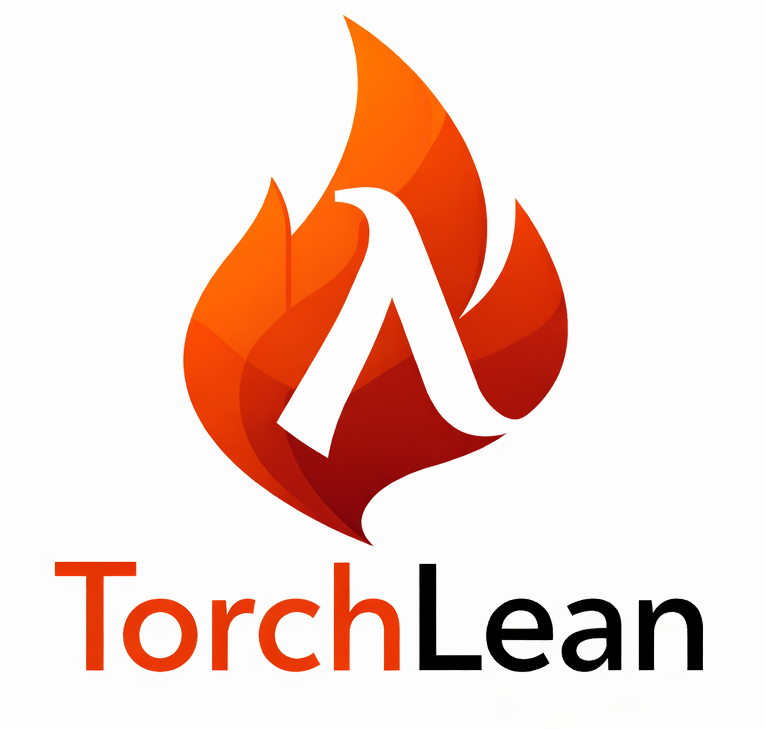

<h1 align="center">
  
  Formalizing Neural Networks in Lean
</h1>

TorchLean brings neural-network programming and formal reasoning into one Lean project. Tensor
shapes are part of the types, models are executable Lean programs, and the same definitions can be
used by training code, graph transformations, certificate checkers, and proofs. CPU and CUDA
backends handle numerical work; the Lean library records the mathematical meaning and assumptions
attached to each path.

## Installation

```bash
git clone https://github.com/lean-dojo/TorchLean.git
cd TorchLean
lake exe cache get
lake build
```

For Linux, macOS, Windows/WSL, CUDA, optional LibTorch support, and an explanation of
TorchLean's backend architecture, see the [Installation guide](https://lean-dojo.github.io/TorchLean/installation/).

TorchLean is pinned by `lean-toolchain` and currently builds with
`leanprover/lean4:v4.33.0`.

## Quickstart

```bash
lake exe torchlean quickstart_mlp --device cpu --steps 10 --arithmetic ieee --execution eager
lake exe torchlean quickstart_mlp --device cpu --steps 10 --execution eager

# Optional CUDA run, if the CUDA toolkit and an NVIDIA GPU are available:
lake -R -K cuda=true build
lake -R -K cuda=true exe torchlean mlp --device cuda --steps 1000
```

The first quickstart uses TorchLean's independent raw-bit binary32 reference. The second uses
Lean's native `Float32` arithmetic. The CUDA command selects the native GPU runtime and reports an
error when CUDA is unavailable.

Application code writes concrete tensor types as `Tensor α [dims...]`, with the element type first.
For example, `Tensor Float [4, 2]` is a four-by-two tensor of `Float` values:

```lean
import NN.API
open TorchLean

/-- A two-layer regression model. The dimensions are checked when the layers are composed. -/
def model :=
  nn.Sequential![
    nn.linear 2 8,
    nn.relu,
    nn.linear 8 1
  ]

-- Four input rows, each containing two features.
def xs : Tensor Float [4, 2] :=
  [[0.0, 0.0], [0.0, 1.0], [1.0, 0.0], [1.0, 1.0]]

-- One regression target for each input row.
def ys : Tensor Float [4, 1] :=
  [[0.2], [1.0], [1.0], [1.8]]

-- The leading `4` counts samples; each sample has shapes `[2]` and `[1]`.
def data : Trainer.Dataset [2] [1] := Data.fromTensors xs ys

def trainOnce : IO Unit := do
  -- Select the loss and train through a typed graph interpreted by IEEE32Exec.
  let trainer :=
    Trainer.new model
      { objective := .meanSquaredError
        optimizer := optim.sgd { learningRate := 0.05 }
        execution := .typedGraph
        device := .cpu
        arithmetic := .ieee }
  -- Inspect the initialized model before any parameter updates.
  let initialPrediction ← trainer.predict ([0.5, -0.25])
  IO.println s!"initial={reprStr initialPrediction}"
  -- Each step averages 16 sample gradients at one parameter point, then updates once.
  -- Training returns a result that retains the updated parameters and run report.
  let trained ← trainer.train data { steps := 200, samplesPerStep := 16, logEvery := 25 }
  trained.printSummary
```

## Commands

```bash
lake exe torchlean --help
lake exe verify --help
lake exe verify -- torchlean-ibp
```

For the maintained examples:

```bash
lake build NNExamples
```

## Use TorchLean From Another Lean Project

TorchLean is a normal Lake package. You can depend on the Git repository directly:

```lean
require TorchLean from git "https://github.com/lean-dojo/TorchLean.git" @ "main"
```

Then run:

```bash
lake update
lake exe cache get
lake build
```

Use `import NN.API` for model, data, and training code. It provides `TorchLean.nn`,
`TorchLean.Data`, `TorchLean.Trainer`, and `TorchLean.optim` without exposing the full proof and
backend trees. Use `NN.API.Verification` to call
`trained.verify center (radius := r) (norm := .inf)` after ordinary training. Explicit verifier
graph lowering has the focused import `NN.API.Verification.Lowering`. Use `import NN` when the
same file also needs proofs or backend infrastructure; focused imports such as `NN.GraphSpec`,
`NN.Runtime`, or `NN.Proofs` are available for subsystem work.

Downstream model and training files should start from:

```lean
import NN.API
open TorchLean
```

The floating-point library can also be used on its own:

```lean
import NN.Floats
open TorchLean.Floats
```

This import provides generic formats and rounding, finite binary32 semantics, executable IEEE
binary32 operations, interval rounders, and scalar quantization. It does not import tensors,
models, autograd, CUDA, certificate checkers, or external numerical tools. More specialized users
can import `NN.Floats.NeuralFloat`, `NN.Floats.FP32`, `NN.Floats.IEEEExec`, or
`NN.Floats.Interval` directly. Tensor quantization and runtime-approximation proofs are separate
adapters under `NN.Spec.Quantization` and `NN.Proofs.RuntimeApprox.FP32`.

For local development against a checkout, use a path dependency instead:

```lean
require TorchLean from "../TorchLean"
```

## Repository Map

- `NN.lean`: complete import for model, tensor, data, training, verification, and proof workflows.
- `NN/API`: the application API exported by `import NN.API` and included by `import NN`.
- `NN/Tensor`: the shared shape-indexed tensor type, packed CPU storage, conversions, and operations.
- `NN/Spec`: mathematical tensor, layer, model, and dynamical-system definitions.
- `NN/Runtime`: executable autograd, optimizers, training loops, CUDA boundary,
  PyTorch import/export, and RL runtime support.
- `NN/Backend`: contract-carrying kernel capsules, the planner, backend profiles, execution
  audits, and the contract check that accepts or rejects a kernel plan.
- `NN/IR` and `NN/GraphSpec`: graph IR, graph semantics, and typed architecture
  descriptions.
- `NN/Proofs`: tensor algebra, selected autograd correctness theorems, analytic derivatives,
  runtime approximation, and bridge proofs.
- `NN/Floats`: finite-precision models, IEEE-style executable semantics,
  NeuralFloat formats, and error-bound infrastructure.
- `NN/MLTheory`: learning theory, robustness, CROWN/LiRPA, generative objectives,
  optimization theory, and related proof layers.
- `NN/Verification`: certificate checkers and CLI workflows.
- `NN/Examples`: quickstarts, runnable model examples, widgets, bundled verification assets,
  and interoperability workflows.
- `home_page/blueprint/TorchLeanBlueprint/Guide`: source for the guide.
- `home_page`: project website sources.

## Proofs And Runtime Boundaries

TorchLean proves properties of explicit Lean definitions. It also checks certificates produced by
external tools, including bound-propagation and scientific-computing workflows. An executable
certificate check reports acceptance by that checker. A semantic guarantee additionally requires
the checker's soundness theorem and its hypotheses; a Lean proof needs kernel-checked evidence of
acceptance. None of these checks certifies the program that produced the certificate.

CPU instructions, CUDA kernels, cuBLAS, LibTorch, PyTorch, Julia, and other external systems are
runtime providers. Their interfaces, assumptions, and available checks are listed in
[`docs/TRUST_BOUNDARIES.md`](docs/TRUST_BOUNDARIES.md). Third-party sources and licenses are listed in
[`docs/THIRD_PARTY_NOTICES.md`](docs/THIRD_PARTY_NOTICES.md), and
[`docs/AI_USAGE.md`](docs/AI_USAGE.md) describes the
project's use of coding assistants.

Contribution guidelines are in [docs/CONTRIBUTING.md](docs/CONTRIBUTING.md).

## Citation

If TorchLean is useful in your work, please cite
[*TorchLean: Formalizing Neural Networks in Lean*](https://arxiv.org/abs/2602.22631):

```bibtex
@misc{george2026torchlean,
  title         = {TorchLean: Formalizing Neural Networks in Lean},
  author        = {George, Robert Joseph and Cruden, Jennifer and Adkisson, Will and
                   Zhong, Xiangru and Zhang, Huan and Anandkumar, Anima},
  year          = {2026},
  eprint        = {2602.22631},
  archivePrefix = {arXiv},
  primaryClass  = {cs.MS},
  url           = {https://arxiv.org/abs/2602.22631}
}
```

## License

TorchLean is released under the MIT License. See `LICENSE`.
