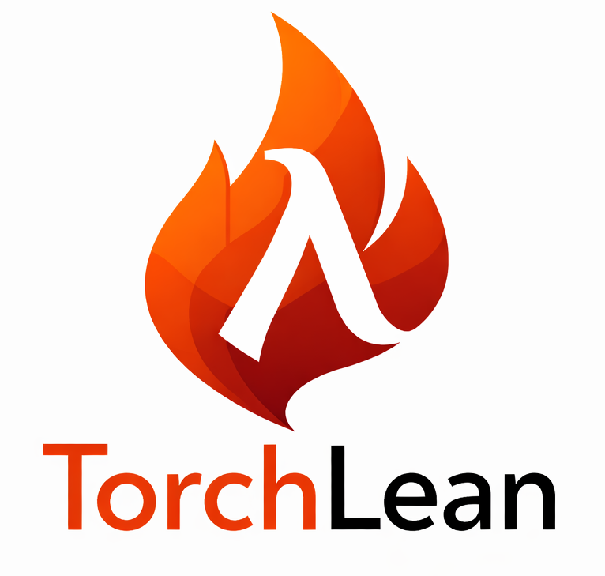

<h1 align="center">
  
  Formalizing Neural Networks in Lean
</h1>

TorchLean brings neural-network programming and formal reasoning into one Lean project. Tensor
shapes are part of the types, models are executable Lean programs, and the same definitions can be
used by training code, graph transformations, certificate checkers, and proofs. TorchLean owns
automatic differentiation; its CUDA backend uses LibTorch's ATen operations to compute tensor
values and local gradients. The Lean library records the mathematical meaning and assumptions
attached to each execution path.

## Installation

```bash
git clone https://github.com/lean-dojo/TorchLean.git
cd TorchLean
scripts/lake.sh exe cache get
scripts/lake.sh build
```

For Linux, macOS, Windows/WSL, CUDA with LibTorch, and an explanation of
TorchLean's backend architecture, see the [Installation guide](https://lean-dojo.github.io/TorchLean/installation/).

## Quickstart

```bash
scripts/lake.sh exe torchlean quickstart_mlp --device cpu --steps 10 --arithmetic ieee --execution eager
scripts/lake.sh exe torchlean quickstart_mlp --device cpu --steps 10 --execution eager

# Optional GPU run with a CUDA-enabled LibTorch SDK, matching toolkit, and NVIDIA GPU:
export TORCHLEAN_LIBTORCH_HOME=/absolute/path/to/libtorch
scripts/lake.sh -Kcuda=true build
scripts/lake.sh -Kcuda=true exe torchlean quickstart_mlp --device cuda --steps 10 --execution eager
```

The first quickstart uses [FloatLib](https://github.com/lean-dojo/FloatLib)'s binary32 arithmetic.
The second uses Lean's native `Float32`.
Typed tensors and models also accept other FloatLib binary formats; see [Precision](#precision).
The CUDA command uses LibTorch's GPU runtime while TorchLean retains its differentiation tape.
It reports an error when CUDA is unavailable.

Application code writes concrete tensor types as `Tensor α [dims...]`, with the element type first.
For example, `Tensor Float [4, 2]` is a four-by-two tensor of `Float` values:

```lean
import NN.API
open TorchLean
open Trainer.Objective (mse)

/-- A two-layer regression model. The dimensions are checked when the layers are composed. -/
def model :=
  nn.Sequential![
    nn.linear 2 8,
    nn.relu,
    nn.linear 8 1
  ]

-- Four input rows, each containing two features.
def xs : Tensor Float [4, 2] :=
  [[0.0, 0.0], [0.0, 1.0], [1.0, 0.0], [1.0, 1.0]]

-- One regression target for each input row.
def ys : Tensor Float [4, 1] :=
  [[0.2], [1.0], [1.0], [1.8]]

-- The leading `4` counts samples; each sample has shapes `[2]` and `[1]`.
def data : Trainer.Dataset [2] [1] := Data.fromTensors xs ys

def trainOnce : IO Unit := do
  -- Select the loss and train through a typed graph with FloatLib binary32 arithmetic.
  let trainer :=
    Trainer.new model
      { objective := mse
        optimizer := optim.sgd { learningRate := 0.05 }
        execution := typedGraph
        device := cpu
        arithmetic := ieee }
  -- Inspect the initialized model before any parameter updates.
  let initialPrediction ← trainer.predict ([0.5, -0.25] : Tensor Float [2])
  IO.println s!"initial={reprStr initialPrediction}"
  -- Each step averages 16 sample gradients at one parameter point, then updates once.
  -- Training returns a result that retains the updated parameters and run report.
  let trained ← trainer.train data { steps := 200, samplesPerStep := 16, logEvery := 25 }
  trained.printSummary
```

## Commands

```bash
scripts/lake.sh exe torchlean --help
scripts/lake.sh exe verify --help
scripts/lake.sh exe verify -- torchlean-ibp
```

For the maintained examples:

```bash
scripts/lake.sh build NNExamples
```

## Use TorchLean From Another Lean Project

TorchLean is a normal Lake package. You can depend on the Git repository directly:

```lean
require TorchLean from git "https://github.com/lean-dojo/TorchLean.git" @ "main"
```

Then run from the downstream project's root, using its own Lake configuration:

```bash
lake update
lake exe cache get
lake build
```

Use `import NN.API` for model, data, and training code. It provides `TorchLean.nn`,
`TorchLean.Data`, `TorchLean.Trainer`, and `TorchLean.optim` without exposing the full proof and
backend trees. Use `NN.API.Verification` to call
`trained.verify center (radius := r)` after ordinary training. Explicit verifier
graph lowering has the focused import `NN.API.Verification.Lowering`. Use `import NN` when the
same file also needs proofs or backend infrastructure; focused imports such as `NN.GraphSpec`,
`NN.Runtime`, or `NN.Proofs` are available for subsystem work.

### Custom tensor computations

We can write a scalar calculation as an ordinary Lean function, apply it to a tensor, and choose
the execution device at the call site:

```lean
import NN.Kernel
open TorchLean

def square := fun (x : Float32) => x * x

def input : Tensor Float32 [3] := Tensor.ofFn fun i => Float32.ofNat (i.val + 1)
def onCpu : IO (Tensor Float32 [3]) := square.run input (device := cpu)
def onGpu : IO (Tensor Float32 [3]) := square.run input (device := gpu)

#eval square.run input (device := cpu)
-- [1.000000, 4.000000, 9.000000]
```

CPU runs the Lean function and is the default. The GPU path compiles a supported FP32/FP64
subset through NVRTC; unsupported code or an unavailable GPU returns an error without a CPU
fallback. It does not compile arbitrary Lean functions or derive custom gradients.
See the [custom-operation guide](NN/Kernel/README.md) for supported operations, indexed programs,
lowering proofs, and the native execution boundary.

### Precision

[FloatLib](https://github.com/lean-dojo/FloatLib) supplies configurable arithmetic and numerical
proofs. TorchLean's CPU tensors and typed models can use binary32, binary128, or a custom binary
format without converting through native floats. GPU providers support their documented formats,
not every FloatLib scalar type.

See the [typed-training example](NN/Examples/Quickstart/TypedTraining.lean) for binary128 training
and the [tensor guide](https://lean-dojo.github.io/TorchLean/blueprint/Building-Models/Tensors-That-Remember-Their-Shapes/)
for precision, shapes, and derivatives. Import `NN.API.Precision` for the scalar integration, or
`FloatLib` for standalone numerical work.

## Repository Map

- `NN.lean`: complete import for model, tensor, data, training, verification, and proof workflows.
- `NN/API`: the application API exported by `import NN.API` and included by `import NN`.
- `NN/Tensor`: the shared shape-indexed tensor type, packed CPU storage, conversions, and operations.
- `NN/Spec`: mathematical tensor, layer, model, and dynamical-system definitions.
- `NN/Runtime`: executable autograd, optimizers, training loops, CUDA boundary,
  PyTorch import/export, and RL runtime support.
- `NN/Backend`: contract-carrying kernel capsules, the planner, backend profiles, execution
  audits, and the contract check that accepts or rejects a kernel plan.
- `NN/IR` and `NN/GraphSpec`: graph IR, graph semantics, and typed architecture
  descriptions.
- `NN/Proofs`: tensor algebra, selected autograd correctness theorems, analytic derivatives,
  runtime approximation, and bridge proofs.
- `NN/Floats`: TorchLean's scalar integration and numerical proof adapters.
- FloatLib dependency: configurable executable formats, reference semantics, rounding proofs,
  and scalar intervals.
- `NN/MLTheory`: learning theory, robustness, CROWN/LiRPA, generative objectives,
  optimization theory, and related proof layers.
- `NN/Verification`: certificate checkers and CLI workflows.
- `NN/Examples`: quickstarts, runnable model examples, widgets, bundled verification assets,
  and interoperability workflows.
- `home_page/blueprint/TorchLeanBlueprint/Guide`: source for the guide.
- `home_page`: project website sources.

## Proofs And Runtime Boundaries

TorchLean proves properties of explicit Lean definitions. It also checks certificates produced by
external tools, including bound-propagation and scientific-computing workflows. An executable
certificate check reports acceptance by that checker. A semantic guarantee additionally requires
the checker's soundness theorem and its hypotheses; a Lean proof needs kernel-checked evidence of
acceptance. None of these checks certifies the program that produced the certificate.

CPU instructions, CUDA kernels, cuBLAS, LibTorch, PyTorch, Julia, and other external systems are
runtime providers. Their interfaces, assumptions, and available checks are listed in
[`docs/TRUST_BOUNDARIES.md`](docs/TRUST_BOUNDARIES.md). Third-party sources and licenses are listed in
[`docs/THIRD_PARTY_NOTICES.md`](docs/THIRD_PARTY_NOTICES.md), and
[the AI usage disclosure](docs/CONTRIBUTING.md#ai-usage-disclosure) describes the
project's use of coding assistants.

Contribution guidelines are in [docs/CONTRIBUTING.md](docs/CONTRIBUTING.md).

## Citation

If TorchLean is useful in your work, please cite
[*TorchLean: Formalizing Neural Networks in Lean*](https://arxiv.org/abs/2602.22631):

```bibtex
@misc{george2026torchlean,
  title         = {TorchLean: Formalizing Neural Networks in Lean},
  author        = {George, Robert Joseph and Cruden, Jennifer and Adkisson, Will and
                   Zhong, Xiangru and Zhang, Huan and Anandkumar, Anima},
  year          = {2026},
  eprint        = {2602.22631},
  archivePrefix = {arXiv},
  primaryClass  = {cs.MS},
  url           = {https://arxiv.org/abs/2602.22631}
}
```

## License

TorchLean is released under the MIT License. See `LICENSE`.
